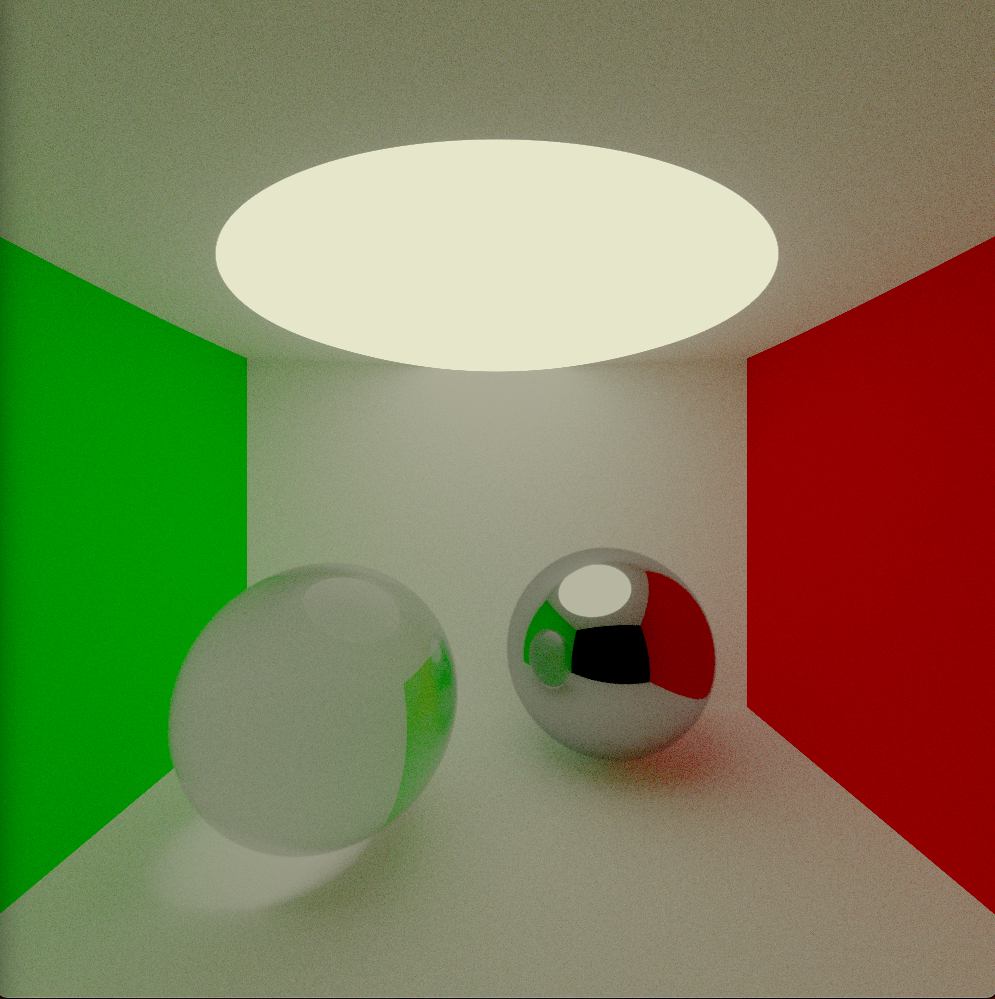
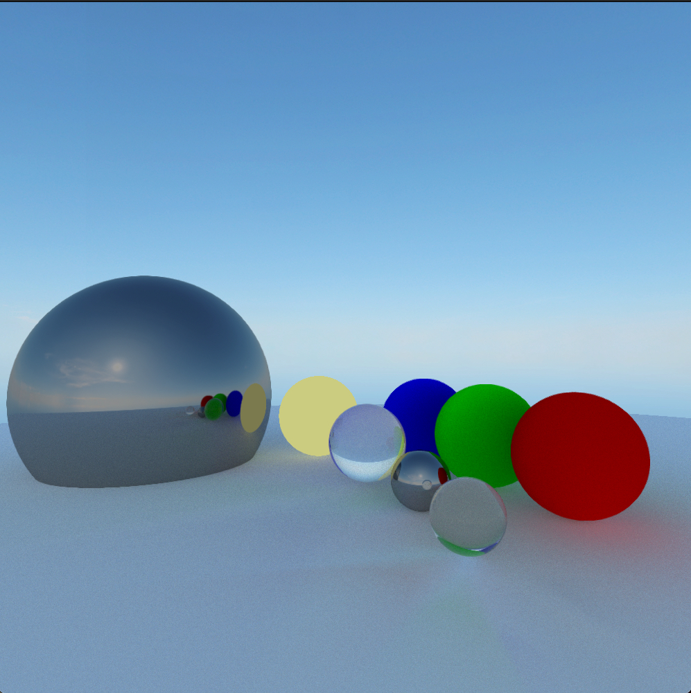

# Honey Comb

- Honey Comb is a rendering engine used to produce pretty images.

# TODO

- Move scenes into scene files
- Triangle intersections
- Add AABB intersections
- Add traversal Accleration Data structures
  - BVH
  - Oct Trees
  - Sparse Oct Trees 
- Add better Probability distribution functions
- Add Sky Box
- add transparency / refraction calculations
- add roughness
- add material class/ object 

- PBR Materials
  - emmisive texture
  - roughness texture
  - normal map texture
  - Transparency texture
  - Metallic Map
