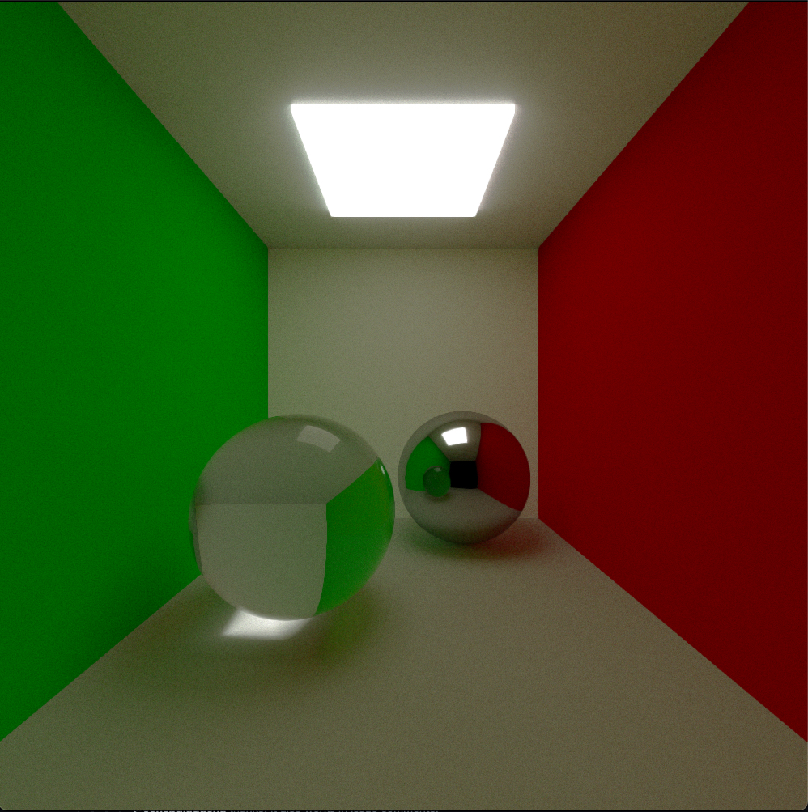
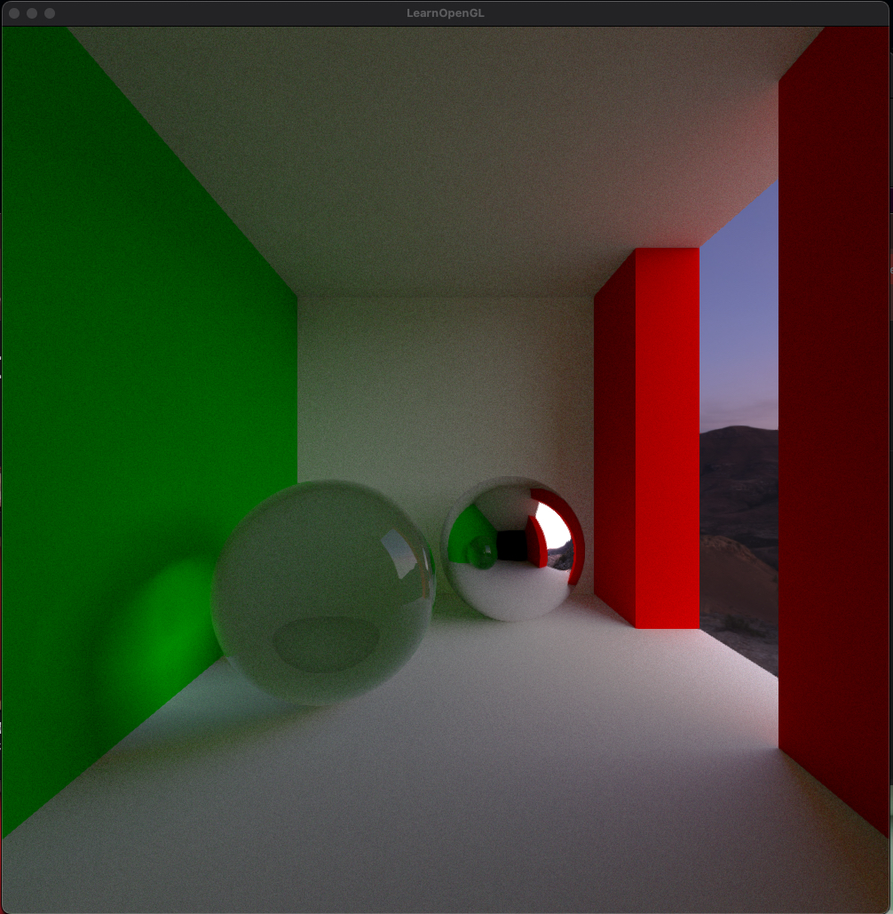
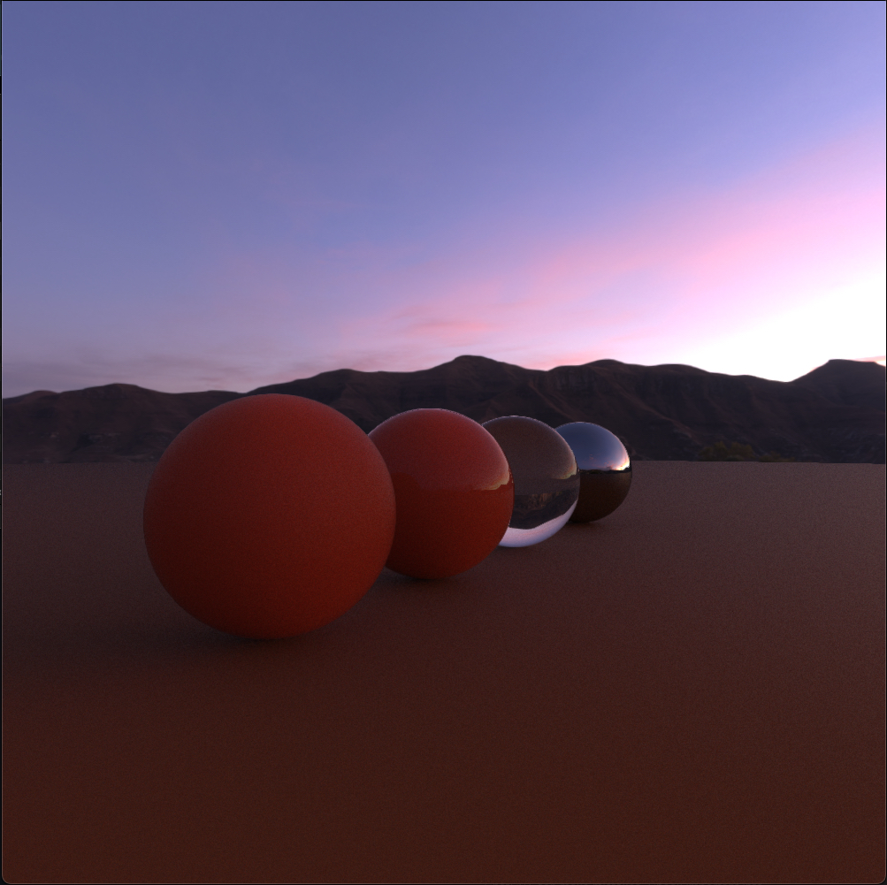

# Honey Comb

- Honey Comb is a rendering engine used to produce pretty images.

 

# TODO

- Triangle intersections
- Add AABB intersections
- Add traversal Accleration Data structures
  - BVH
  - Oct Trees
  - Sparse Oct Trees 
- Add better Probability distribution functions

- PBR Materials Textures
  - emmisive texture
  - roughness texture
  - normal map texture
  - Transparency texture
  - Metallic Map
